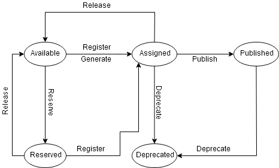

# Snow Owl Component Identifier Service

## Introduction
Snow Owl<sup>®</sup> Component Identifier Service is a centralized solution for SNOMED CT Identifier allocation and registration. 
It is an alternative solution for the [official Component Identifier Service](https://github.com/IHTSDO/component-identifier-service) implementation.

## Features
* Single and Bulk allocation of SNOMED CT Identifiers through Java and REST APIs
* Authentication with Snow Owl compatible identity services
* Out of the box integration with [Snow Owl](https://github.com/b2ihealthcare/snow-owl)
* Built on top of Elasticsearch (highly scalable, distributed, open source search engine)
  * Connect to your existing cluster or use the embedded instance
  * All the power of Elasticsearch is available (full-text search support, monitoring, analytics and many more)

## Install and Run

NOTE: You need to have a recent version of Java installed (Java 8 update 171 or newer).

Once you have downloaded the appropriate package:

* Run `bin/cis.sh` on unix, or `bin/cis.bat` on windows
* See [REST API docs](http://localhost:8080/snowowl/cis)

## Configuration

## Snow Owl integration

Snow Owl CIS can be integrated with one or more Snow Owl Terminology Server instance(s) to support the necessary SNOMED CT ID allocation from a centralized place as opposed to relying on the embedded CIS module from any of these instances.
To configure:
* Install and run Snow Owl CIS
* Configure the `cis.strategy`, `cis.cisBaseUrl`, `cis.cisUsername`, `cis.cisPassword` configuration parameters on each Snow Owl instance to the same values. Example configuration:

```
cis:
  strategy : CIS
  cisBaseUrl: http://localhost:9090/snowowl/cis/
  cisUserName: snowowl
  cisPassword: snowowl
```

## Data

By default Snow Owl CIS stores its data under the `CIS_HOME/resources` folder.
It can be configured with the `resourcesDirectory` configuration parameter. NOTE: this parameter is a relative path to the installation directory.

## Backup and Restore

There are two ways to back up and restore Snow Owl CIS data.

### Cold backup and restore

When Snow Owl CIS is offline, it is possible to backup the currently set `resourcesDirectory` and send it to a few external locations for redundancy.
To restore a previous backup just replace the resourcesDirectory contents from the backup and start Snow Owl CIS.
NOTE: while this might work in certain use cases (testing, evaluation, etc.), it is recommended to use the Hot backup and restore method instead.

### Hot backup and restore

NOTE: This is the recommended backup and restore solution for Snow Owl CIS.
Using the Snapshot and Restore API of the underlying Elasticsearch instance administrators can create incremental backups and restore to specific tagged backups when necessary.
See more details at: https://www.elastic.co/guide/en/elasticsearch/reference/6.5/modules-snapshots.html

## SCTID lifecycle


